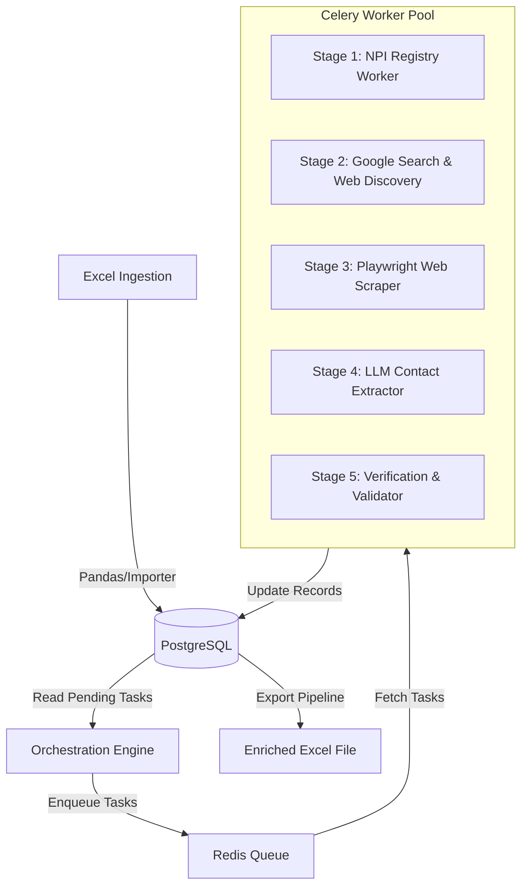

# Phase 1: Folder Structure & Excel Schema Analysis Report

This document serves as the Phase 1 Deliverable for the Contact Enrichment Engine. It outlines the project's folder layout, identifies the primary Excel dataset, details its column schema, summarizes data quality findings, highlights potential engineering risks, and provides a suggested system architecture and pipeline roadmap for subsequent phases.

---

## 1. Project Folder Structure

The directory tree has been successfully initialized. Only missing folders were created; no existing workspaces or files were modified.

```text
├── data/                    # Data storage layer
│   ├── input/               # Raw input datasets (e.g., us_investors_enriched.xlsx)
│   ├── output/              # Exporter destinations for completed runs
│   └── temp/                # Temp storage for web scrape cache and batch dumps
├── src/                     # Core Engine Architecture
│   ├── config/              # Environment config schemas (Pydantic settings)
│   ├── database/            # SQLAlchemy models, Postgres session setup, migrations
│   ├── importer/            # Excel sheet ingestion parsers
│   ├── queue/               # Celery app config, broker links
│   ├── workers/             # Celery worker definitions (Search, Scrape, AI extraction)
│   ├── search/              # Google Custom Search API / SerpAPI query wrappers
│   ├── scraper/             # Playwright crawler framework
│   ├── extractor/           # Text extraction, cleanups, HTML-to-markdown parsers
│   ├── validator/           # Verification logic (regex phone, SMTP MX lookup)
│   ├── ai/                  # LLM extraction layer (OpenAI/Gemini schema parsers)
│   ├── exporter/            # Final formatter to Excel / CSV
│   ├── cache/               # Redis key-value cache accessors
│   ├── utils/               # Rate limiters, logging configs, retry decorators
│   └── monitoring/          # Grafana logging / Prometheus telemetry hooks
├── logs/                    # Engine execution logs
├── tests/                   # Pytest automation test suite
├── docs/                    # Architectural documents and design schemas
├── scripts/                 # Administration and database migration scripts
```

---

## 2. Detected Excel File & Dataset Statistics

The project directory was searched recursively for Excel files (`.xlsx` / `.xls`).

* **Detected Excel File:** `us_investors_enriched.xlsx`
* **File Location:** Project Root
* **Number of Sheets:** `2`
* **Sheet Names & Layouts:**
  1. `Status` (Dimensions: 1 row, 2 columns - Metadata summary)
  2. `Investor Contacts` (Dimensions: 10,000 rows, 46 columns - Core raw dataset)
* **Automatically Detected Primary Dataset:** `Investor Contacts` (contains `460,000` data cells).

### Dataset Summary Statistics (Primary Sheet)
- **Total Rows:** `10,000`
- **Total Columns:** `46`
- **Duplicate Column Names:** `0` (None detected)
- **Duplicate Records (Whole Row):** `0`
- **Duplicate Names (`First name` + `Last name`):** `8`
- **Duplicate Websites (`Source Website`):** `1,620` (out of 4,625 non-null rows)
- **Duplicate Emails (`Email`):** `214` (out of 3,897 non-null rows)

---

## 3. Dataset Column Schema & Guess Types

Below is the complete catalog of columns in the `Investor Contacts` dataset. Out of the 46 columns, **28 columns (60.8%) are entirely empty (100% missing values)**. These represent pre-defined schema placeholders that the Enrichment Engine must populate during processing.

| # | Column Name | Guessed Data Type | Empty Count | Missing % | Notes / Purpose |
|---|---|---|---|---|---|
| 1 | `NPI` | String / Text | 0 | 0.00% | National Provider Identifier (Unique US medical ID) |
| 2 | `First name` | String / Text | 1,433 | 14.33% | First Name of practitioner |
| 3 | `Middle name` | String / Text | 6,839 | 68.39% | Middle Name / Initial |
| 4 | `Last name` | String / Text | 47 | 0.47% | Last Name of practitioner |
| 5 | `Suffix` | Empty / Undefined | 10,000 | 100.00% | Name suffix (e.g. Jr, III) |
| 6 | `Credential` | Empty / Undefined | 10,000 | 100.00% | Degree credentials (e.g. MD, DO) |
| 7 | `Grouping` | Empty / Undefined | 10,000 | 100.00% | Provider group classification |
| 8 | `Classification` | Empty / Undefined | 10,000 | 100.00% | Specialty classification |
| 9 | `Specialization` | Empty / Undefined | 10,000 | 100.00% | Sub-specialization |
| 10 | `Specialty name` | Empty / Undefined | 10,000 | 100.00% | Taxonomy-mapped specialty |
| 11 | `Specialty path` | Empty / Undefined | 10,000 | 100.00% | Classification category breadcrumbs |
| 12 | `Taxonomy code` | Empty / Undefined | 10,000 | 100.00% | CMS Taxonomy identification code |
| 13 | `Years in practice` | Empty / Undefined | 10,000 | 100.00% | Estimated practice length |
| 14 | `Solo practitioner` | Empty / Undefined | 10,000 | 100.00% | Solo practice flag |
| 15 | `License number` | Empty / Undefined | 10,000 | 100.00% | State licensing number |
| 16 | `License state` | String / Text | 9,999 | 99.99% | State issuing the license (1 valid value present) |
| 17 | `Address line 1` | String / Text | 0 | 0.00% | Physical address street |
| 18 | `Address line 2` | String / Text | 8,321 | 83.21% | Suite, Floor, or Office identifier |
| 19 | `City` | String / Text | 2 | 0.02% | Mailing address city |
| 20 | `State` | String / Text | 0 | 0.00% | Mailing address state |
| 21 | `Postal code` | Empty / Undefined | 10,000 | 100.00% | ZIP / Postal Code |
| 22 | `Country` | String / Text | 0 | 0.00% | Mailing address country (e.g. US) |
| 23 | `Phone` | String / Text | 5,604 | 56.04% | Contact Phone Number |
| 24 | `Email` | String / Text | 6,103 | 61.03% | Contact Email Address |
| 25 | `Email confidence` | Empty / Undefined | 10,000 | 100.00% | Email quality score placeholder |
| 26 | `Quality score` | Integer | 0 | 0.00% | Initial quality rank (all rows initialized) |
| 27 | `Last verified` | String / Text | 0 | 0.00% | Timestamp of last verification check |
| 28 | `Updated` | String / Text | 0 | 0.00% | Timestamp of database update |
| 29 | `Status` | String / Text | 0 | 0.00% | Operational status indicator |
| 30 | `Email verification` | Empty / Undefined | 10,000 | 100.00% | Verification status placeholder |
| 31 | `Email verification confidence` | Empty / Undefined | 10,000 | 100.00% | Verification rating placeholder |
| 32 | `Email verified at` | Empty / Undefined | 10,000 | 100.00% | Email verification date placeholder |
| 33 | `Phone verification` | Empty / Undefined | 10,000 | 100.00% | Phone status placeholder |
| 34 | `Phone verification confidence` | Empty / Undefined | 10,000 | 100.00% | Phone confidence placeholder |
| 35 | `Phone verified at` | Empty / Undefined | 10,000 | 100.00% | Phone verification date placeholder |
| 36 | `License verification` | Empty / Undefined | 10,000 | 100.00% | License status placeholder |
| 37 | `License verification confidence` | Empty / Undefined | 10,000 | 100.00% | License confidence placeholder |
| 38 | `License verified at` | Empty / Undefined | 10,000 | 100.00% | License verification date placeholder |
| 39 | `Address verification` | Empty / Undefined | 10,000 | 100.00% | Address verification status placeholder |
| 40 | `Address verification confidence` | Empty / Undefined | 10,000 | 100.00% | Address confidence placeholder |
| 41 | `Address verified at` | Empty / Undefined | 10,000 | 100.00% | Address verification date placeholder |
| 42 | `Workplace verification` | Empty / Undefined | 10,000 | 100.00% | Workplace check status placeholder |
| 43 | `Workplace verification confidence` | Empty / Undefined | 10,000 | 100.00% | Workplace confidence placeholder |
| 44 | `Workplace verified at` | Empty / Undefined | 10,000 | 100.00% | Workplace verification date placeholder |
| 45 | `Source Website` | String / Text | 5,375 | 53.75% | Company/Practitioner website domain |
| 46 | `Confidence` | String / Text | 6,176 | 61.76% | Initial dataset confidence score |

---

## 4. Data Quality & Enrichment Summary

### Core Column Presence
* **Phone Columns:** Exists (`Phone`). Verification helper columns are empty.
* **Email Columns:** Exists (`Email`). Verification helper columns are empty.
* **Website Columns:** Exists (`Source Website`).
* **Company Name Column:** *None explicitly exists*. The records identify individual practitioners using NPI, First Name, and Last Name. The practitioner serves as the core entity.
* **Address Columns:** Exists (`Address line 1`, `Address line 2`, `City`, `State`, `Postal code`, `Country`). Note that `Postal code` is 100% missing.

### Enrichment Estimations
* **Total Records Needing Enrichment:** `6,180` (Missing email, phone, or both)
* **Records Already Completed:** `3,820` (Contain both email and phone)
* **Records Missing Email Only:** `576` (Have phone, missing email)
* **Records Missing Phone Only:** `77` (Have email, missing phone)
* **Records Missing Both:** `5,527` (Both fields are null)

---

## 5. Schema & Ingestion Recommendations

### Recommended Keys and Columns
* **Primary Key:** `NPI` (National Provider Identifier). It is unique for all 10,000 records and has 0 missing values. Using `NPI` as the key prevents duplicates and links directly to official healthcare registries.
* **Search Columns (for discovery):** `First name`, `Last name`, `City`, `State`, `Country`. Combine these to run search queries (e.g. `"[First name] [Last name] [City] MD website"`).
* **Contact Columns:** `Email` and `Phone` (for validation and output mapping).
* **Output Columns:** `Email`, `Phone`, `License number`, `License state`, `Specialty name`, and all verification columns.

---

## 6. Recommended System Architecture



### Key Infrastructure Layers
1. **Database (PostgreSQL):** Keeps track of ingestion state, transaction histories, search logs, and verification confidence metrics. Highly recommended over raw memory buffers due to API failure rates and process pauses.
2. **Task Queue (Redis + Celery):** Distributes tasks to scale scraping and AI calls. Helps manage rate-limiting and task retries.
3. **Scraper (Playwright Headless + HTTPX):** Playwright handles complex JavaScript-heavy websites. HTTPX is used for lightweight API endpoints (such as public NPI lookup registries).
4. **AI Processing (Gemini-2.5 / GPT-4o-mini):** Utilizes JSON schema validation (via Pydantic and instructor) to retrieve structured contact details, emails, and phone numbers from raw HTML pages.
5. **Verification Engine:**
   - **Email:** DNS/MX lookup and SMTP handshake simulators to prevent bounces.
   - **Phone:** Regular expression cleaning and Libphonenumber verification (standardizing to E.164).

---

## 7. Potential Engineering Risks & Mitigations

1. **High missing data density (61% of columns):**
   * *Risk:* 28 columns are completely blank. Processing 10,000 records requires extensive API queries and API costs could escalate.
   * *Mitigation:* Cache all web queries and search results in Redis/Postgres. Implement strict validation before triggering expensive AI extraction blocks.
2. **Missing ZIP Codes:**
   * *Risk:* `Postal code` is 100% missing. This makes physical address validation or search queries less precise.
   * *Mitigation:* Query the official **NPI Registry API** (which is open and free) using the provided `NPI` to pull official ZIP codes, License Numbers, License States, and Specialties before starting web search.
3. **Playwright IP Blocking & Anti-Bot systems:**
   * *Risk:* Scraping practitioner sites directly can trigger Cloudflare/bot screens.
   * *Mitigation:* Use rotating user-agents, stealth packages, and proxy support in `.env`.
4. **LLM Hallucinations on Scraping:**
   * *Risk:* LLM might extract generic administrative emails (e.g. `support@cloudflare.com`) instead of the doctor/investor's actual contact.
   * *Mitigation:* Restrict extraction domains. Prompt LLM to exclude domain registrar emails or common privacy emails.

---

## 8. Suggested Pipeline Stages (Phase 2 & Beyond)

* **Stage 1: Raw Ingestion** - Parse the Excel file and bulk copy to Postgres with status `PENDING`.
* **Stage 2: Official Metadata Lookup** - Call the official registry API via `NPI` to fetch license states, taxonomy details, official address lines, and zip codes.
* **Stage 3: Web Discovery** - Query Google Custom Search Engine with the name and location to retrieve the primary website URL.
* **Stage 4: Headless Scraping** - Crawl the home page, contact page, and about page of the URL using Playwright.
* **Stage 5: AI Contact Extraction** - Pass clean HTML/markdown text to LLM to extract emails, phones, and contacts.
* **Stage 6: Multi-layer Validation** - Run regex check, SMTP MX validation on emails, and local number checks on phones.
* **Stage 7: Dataset Export** - Generate the final `.xlsx` with all 46 columns fully populated.
